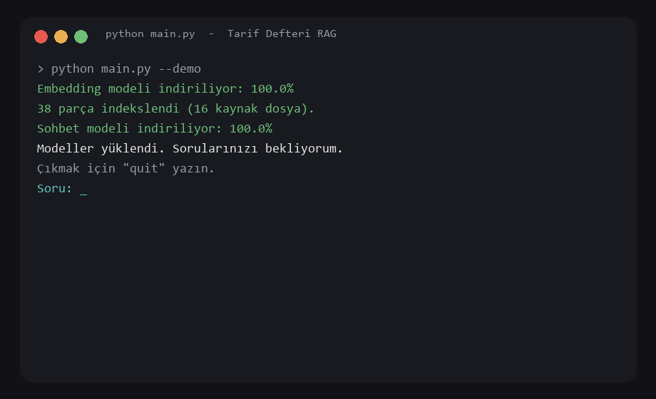
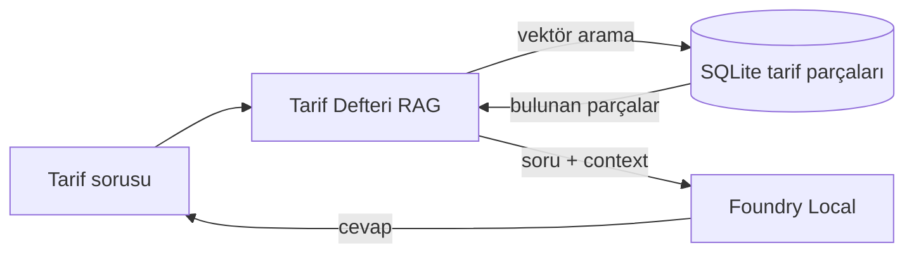

# Tarif Defteri Asistanı (Foundry Local RAG)

Yemek tarifleri üzerine yerel belge asistanı. Soru sorulunca önce defterdeki tariflerde ilgili parça bulunur, sonra cevap yalnızca o context ile cihazda üretilir. Microsoft Foundry Local RAG: embedding, kosinüs arama, SQLite, yerel sohbet.



## Problem

Genel bir dil modeli, senin defterinde olmayan bir tarifi uydurabilir. Bu asistan RAG kullanır: önce ara, sonra üret. Tarif belgede yoksa “Bu bilgi context'te yok.” der. Varsa kaynak dosyayı belirtir (`menemen.txt` gibi).

Bilgi tabanı: `knowledge/` altında tarifler ve `diyet.txt` (vegan / sebzesiz / vejetaryen / tatlı / kahvaltı / meze / çorba / etli listeleri).

## Nasıl çalışır

Tek makinede dört katman:

1. **Arayüz:** turuncu-sarı Tarif Defteri: `streamlit run app.py` (soru = RAG; malzeme ve galeri durur)
2. **Arama:** soruyu göm, kosinüs ile 2–3 tarifi seç, prompt’a ekle
3. **Veri:** tarif parçaları `data/knowledge_base.db`
4. **Yerel model:** Foundry Local: `qwen3-embedding-0.6b` + `qwen2.5-0.5b`

Akış: tarif sorusu → embedding → SQLite → `[Kaynak: menemen.txt]` → yerel chat.

Plan kazanımları (Foundry RAG iskeleti) tarif konusuna uygulandı: Hello Model, ingestion, kosinüs, SQLite, sistem prompt, kaynak atfı, “bilmiyorum”, CLI demo.

```bash
python hello_model.py
python main.py --demo
streamlit run app.py
```



## Kurulum

```bash
python -m venv venv
venv\Scripts\activate
pip install -r requirements.txt
```

Gereksinim: Python 3.11+, Windows (Foundry Local WinML).

## Çalıştırma

```bash
python hello_model.py
python ingestion.py
python main.py
python main.py --demo
streamlit run app.py
```

İlk seferde modeller iner. Çıkış: `quit`

Yeni tarif için `knowledge/` altına `.txt` koy, `python main.py` veya `ingestion.py` çalıştır.

## Canlı demo

1. Cevaplanabilir: `Menemen nasıl yapılır?`  
   Beklenen: soğan, biber, domates, yumurta + `menemen.txt`
2. Vegan: `vegan tarif öner`  
   Beklenen: kısır, imam bayıldı, sebze güveç + `diyet.txt`
3. Sebzesiz: `sebzesiz tarif öner`  
   Beklenen: omlet, pilav, baklava, sütlaç, brownie + `diyet.txt`
4. Cevaplanamaz: `Bu uygulamanın aylık barındırma maliyeti nedir?`  
   Beklenen: `Bu bilgi context'te yok.`
5. Boş soru: Enter  
   Beklenen: `Boş soru gönderildi.`

Ayrıntı: [docs/evaluation.md](docs/evaluation.md)

## Tasarım kararları

- Konu tarif defteri; Foundry Local yalnızca yerel RAG motoru.
- Küçük sohbet modeli: hız. `min_score=0.45`: alakasız parçayı modele vermemek.
- Sistem prompt: yalnızca tarif context’i, kaynak adı, yoksa uydurma.

## Microsoft kaynakları

- [What is Foundry Local?](https://learn.microsoft.com/azure/ai-foundry/foundry-local/what-is-foundry-local)
- [Tutorial: Build a RAG application](https://learn.microsoft.com/azure/ai-foundry/foundry-local/tutorials/build-rag-application)

## Testler

```bash
pytest -q
```

## Dosyalar

- `app.py`: Tarif Defteri arayüzü (soru = Foundry RAG)
- `main.py`: RAG CLI ve plan demosu
- `knowledge/`: tarif metinleri ve diyet listesi
- `ingestion.py` / `knowledge_store.py` / `retrieval.py`: parçala, SQLite, kosinüs
- `hello_model.py`: Foundry kurulum testi

## Kısıtlar

- İlk model indirmesi için internet gerekir; cevap yerelde üretilir.
- Küçük model kısa sapma yapabilir; eşik ve prompt bunu sınırlar.

## Neler öğrendik

- RAG: bul, ekle, üret. Tarif defterine uygulanınca uydurma azalır.
- Kaynak dosya adı hem aramayı hem atfı tutar.
- Zayıf eşleşmeyi modele vermemek, yalnızca prompt yazmaktan daha güvenilir.
